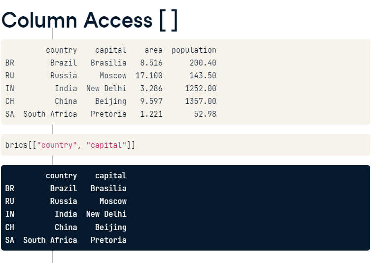
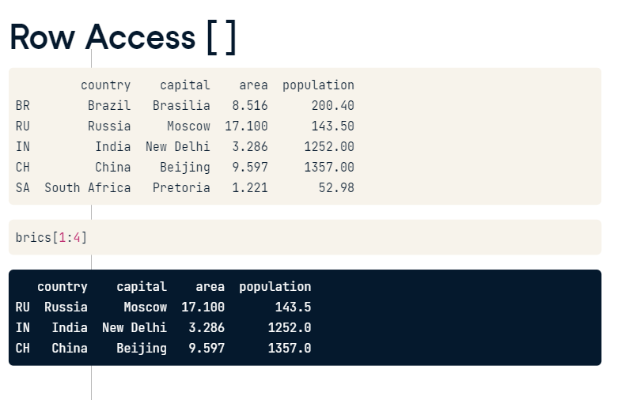
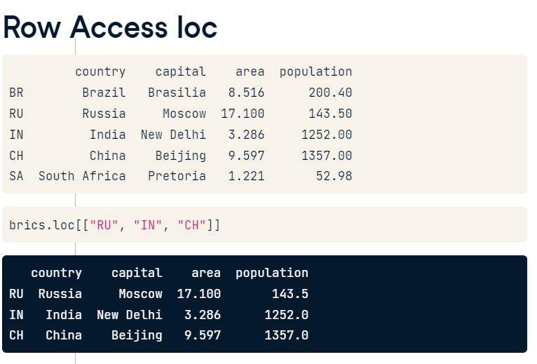
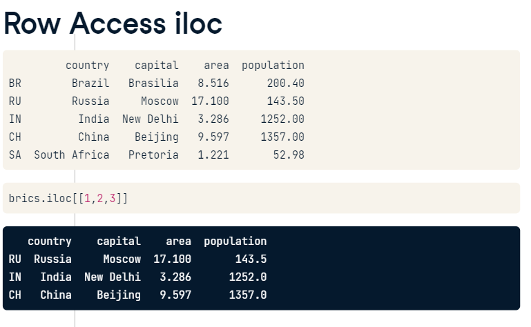

# 📚🗓️ Welcome to Python For Data Analysis! 🤓📊

- In this Git repo, I'll embark on a python learning adventure 🚀💻 to become a Python master 🎓🔍. 

- Get ready to explore Python fundamentals 📝.With each passing day, I'll level up my Python skills! 💪📈

- Join My coding journey 🚶‍♂️🚶‍♀️, and let's make data dance to our tunes! 🕺💃 Feel free to collaborate 👥🤝, share your insights 💬

- Happy Python learning! 🤩📚💻  #PythonMaster #DataNinja 🐱‍👤🔥

## Learning Logs 📑
| Index | Skill Learned |
| ----------- | ----------- |
|1|Pandas|
|2|Numpy|
|3|Matplotlib|

# Pandas
- Pandas is a Python library used for working with data sets.
- It has functions for analyzing, cleaning, exploring, and manipulating data.

### Creating data frame from dictionary - [Notebook](/Pandas/Dictionary_to_dataframe.ipynb)
```python
import pandas as pd

# Build cars DataFrame
names = ['United States', 'Australia', 'Japan', 'India', 'Russia', 'Morocco', 'Egypt']
dr =  [True, False, False, False, True, True, True]
cpc = [809, 731, 588, 18, 200, 70, 45]
cars_dict = { 'country':names, 'drives_right':dr, 'cars_per_cap':cpc }
cars = pd.DataFrame(cars_dict)
print(cars)

# Definition of row_labels
row_labels = ['US', 'AUS', 'JPN', 'IN', 'RU', 'MOR', 'EG']

# Specify row labels of cars
cars.index = row_labels

# Print cars again
print(cars)
```
### Reading a CSV file
- we can read CSV file using pandas read_csv(/path/fileame.csv) function
```python
import pandas as pd

dataframe = pd.read_csv('data.csv') 
print(dataframe)
```
### Selecting Data using index
- Square brackets
- loc
- iloc







